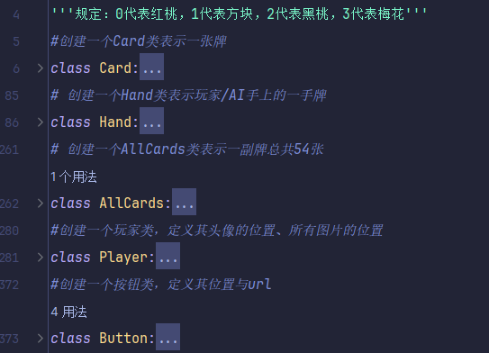
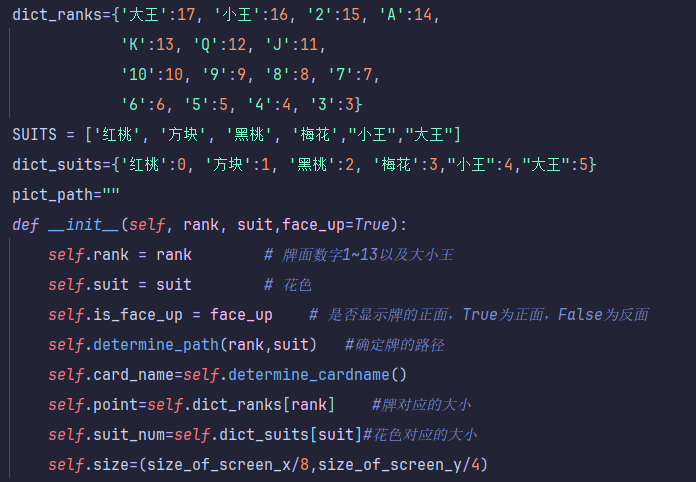
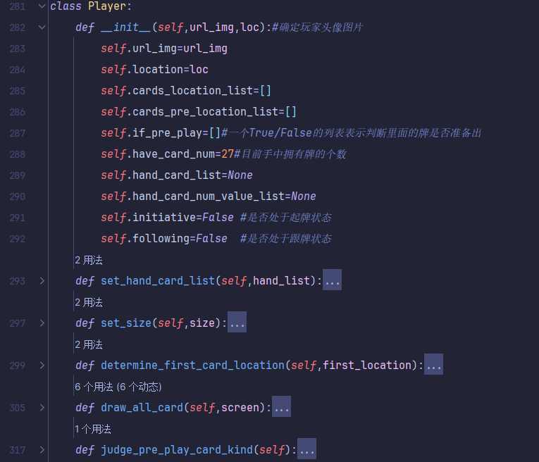
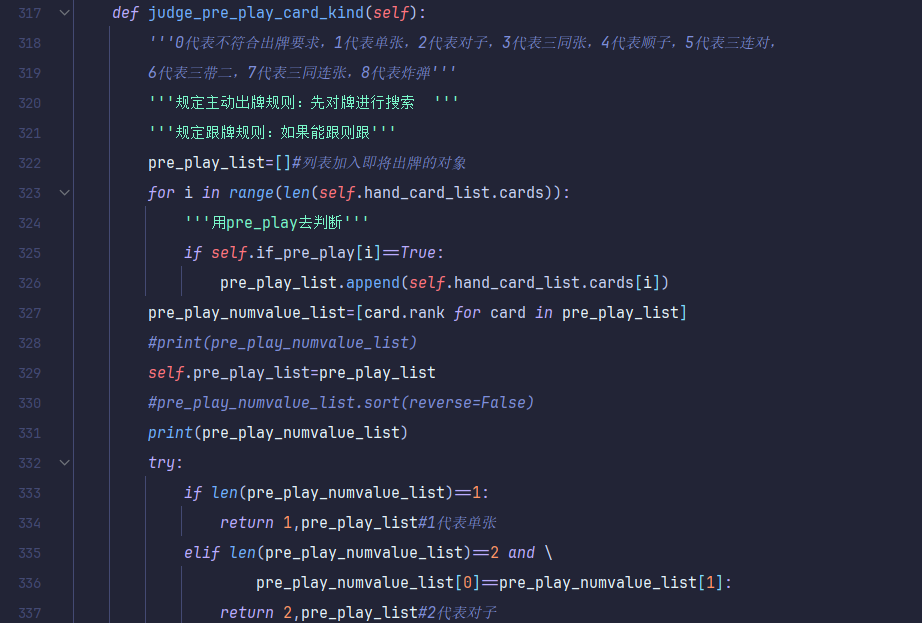
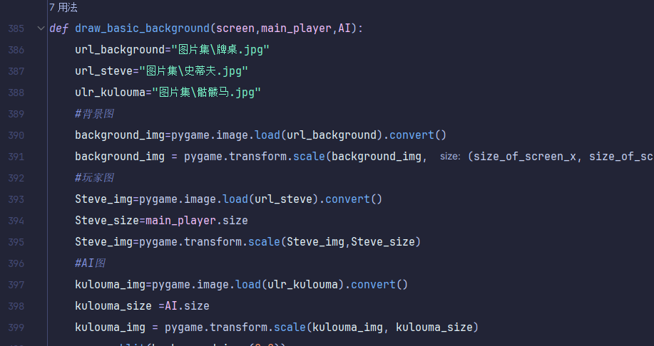
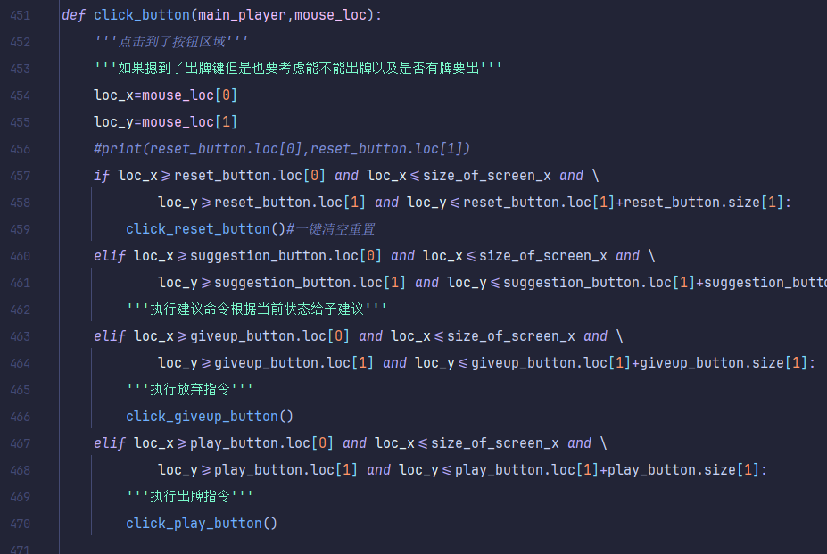
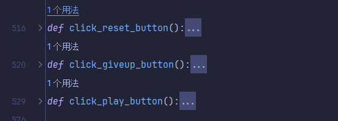
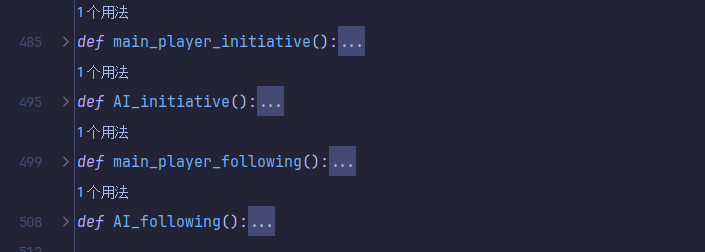
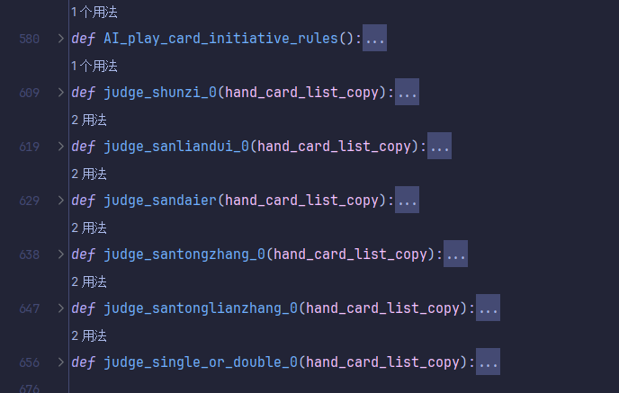
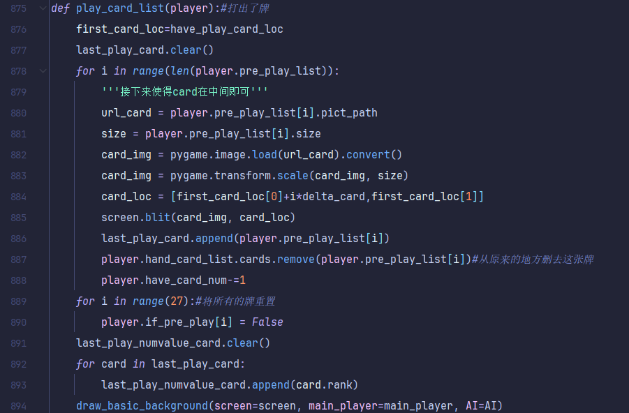

# 人工智能程序设计大作业之掼蛋

## 阶段一
### 实现目标：基于规则的策略实现AI的自动打牌 ###
### 实现方式：Pygame可视化交互界面 ###
### 规则介绍： ### 
1. 若自己为下家则必须与上家出同种类型且更大；若为上家，则可以任意出牌  
2. 先出的一方为上家，跟牌的一方为下家；若某一回合无法接牌，选择pass，则对方自动成为上
家
### 牌型种类： ###
1. 单张  
A > K > Q> J > 10 > 9 > 8 >7 > 6 > 5 > 4 > 3 > 2
2. 对子  
22 > AA > KK > ... > 33，不计花色，上家出33，必须出44或以上
3. 顺子  
连续的5张牌，不计花色，例如：23456，10JQKA 
4. 三连对  
连续的3条对子，例如：778899，445566等
5. 三同张  
3张一样的牌，例如222，AAA，666，888等
6. 三带对  
3张一样的牌带2张一样的牌，例如22233，AAAJJ等
7. 三同连张  
两个连续的三同张，例如 222 333，777 888等
8. 炸弹  
四张或四张以上牌点相同的牌，如：2222、33333、444444等
注意：此处不考虑同花顺的存在
### 牌型大小： ###
1. 牌点由大到小排列为：2、Ａ、Ｋ、Ｑ、Ｊ、10、 ９、８、７、６、５、４、３ 
   注意此处级牌为2因此2才是最大的，在一般的大小排序中2是最小的 
2. 相同牌型之间的大小比较： 
   1. 单张、对子、三同张、三连对、三同连张、顺子，以上六种牌型直接根据牌点确定大小。 
   2. 三带对：仅比较三同张牌点大小，不比较所带对子牌点大小。 
   3. 炸弹：张数多者大，张数相同则比较牌点大小。 
3. 不同牌型之间的大小比较 
   炸弹 > 其他7种牌型（单张、对子、三同张、三带对、三连对、三同连张和顺子）
### 实现具体功能： ###
1. 牌型识别：  
AI需要能够识别所有可能的牌型，包括单张、对子、顺子、连对、三带、炸弹 
这要求程序能够分析手中的牌并确定所有可能的合法出牌选项       <!--注意：&emsp;与&nbsp;代表缩进符用于缩进-->
2. 出牌规则： 
定义一套出牌规则，让AI决定何时跟牌、何时主动出牌 
如果AI是上家，它可能会选择较弱的牌型出牌；如果是下家，它可能需要选择能够大于上家的牌型
3. 优先级设置： 
为AI设置不同的牌型和出牌策略的优先级。通常情况下，炸弹等强力牌型应当作为最后的手段，除非该出牌显著提高胜率。
### 目标实现效果（基于规则）： ###
1. 可以实现可视化界面用户通过鼠标点击牌实现上下移动，点击出牌实现出牌与自己所拥有牌的更新
2. 由于只有用户与AI进行打牌而且仅有一副牌因此双方明牌
3. 系统判断玩家所打出的牌是合理的牌型，并且要么牌型可接，要么玩家是上家，才能完成出牌操作
4. 否则提示玩家”无效出牌“，玩家修改牌序列，或选择pass弃牌
5. 最后谁先打完牌就显示谁胜利
### 基本框架思路介绍： ###
1. 先用pygame模块搭建好用户交互界面并且导入相应的牌所对应的图片，构建一个牌类class
2. 对54张牌进行随机打乱，各分一半，构建双方牌库的列表，然后对双方牌库进行降序排序并显示
3. 随机设定谁先出牌（上家），上家出牌一般从小到大进行出牌
4. 玩家出牌之后如果AI存在比玩家强的牌则出，如果没有则pass 
如果AI手中只有炸弹，则定下规则当玩家手中牌数少于6张或者AI手中牌数少于10张时才跟牌否则留存
5. 构建一个牌库列表，判断玩家和AI手上牌的种类及其个数 
（单张、对子、三同张、三带对、三连对、三同连张、顺子和炸弹及其个数） 
每一次出牌之后都立马更新牌库并显示
### 主要类和函数介绍： ###
1. 这里一共创建了5个类 
 
分别代表一张牌、一手牌、一整副牌（因为一般的掼蛋游戏是有两副完整的牌的）、玩家和按钮 
（1）牌类的存在是为了当可视化，每一张牌都是一个独立的对象，当打出牌的时候，需要确定打出的是哪一张牌 
 
这里面每一张牌的属性具体有点数、花色、图片的路径、牌的名字、点数对应的大小、花色对应的大小、牌的大小 
牌类具体的函数只有两个，一个是确定这张牌对应的图片路径，另一个是确定这张牌对应的名字 
（2）手牌类的存在是为了确定玩家的手牌有哪些内容，其中有一个Hands.cards[]列表存储每一个牌对象 
（3）一整副牌类存在是为了初始化一开始所有的54张牌并利用random.shuffle()函数将其随机打乱切分一般分别分给两个Player玩家 
（4）玩家类 
 
玩家类里面主要包括玩家手里的手牌、玩家头像位置、玩家所有手牌的位置列表、玩家所有牌是否要准备出牌了、以及玩家当前处于起牌/跟牌阶段 
其附属的函数包括初始化当前的手牌、设置当前所有牌对应的位置并将其画出、对当前所有的牌搜索空间进行搜索并且得出所有牌型种类以及允许出的牌型列表 
 
返回牌的预出牌种类：0代表不符合出牌要求，1代表单张，2代表对子，3代表三同张，4代表顺子，5代表三连对，6代表三带二，7代表三同连张，8代表炸弹 
（5）还有一个按钮类 
按钮类的存在主要是为了有： 
RESET键（重置键为了玩家将点起来的牌放下去） 
出牌键（将点起来的牌出掉） 
不出键（在跟牌阶段放弃出牌） 
建议键（当前还未实现，之后会对程序继续更新会加入给玩家推荐出牌的功能） 
2. 画出基本图像的函数 
 
该函数用于画出函数的基本图像，主要包括： 
背景图、玩家图、AI图、按钮图、玩家和AI手中还有的牌、打出的牌 
3. 如果按下了按钮的函数 
 
如图，由于使用了pygame的模块，因此可以获得按下了按钮之后鼠标所在的位置 
之前在按钮类里面已经确定了按钮所在的位置，因此可以很轻松判断按到了哪个键并执行相应的操作即可 
 
4. 主玩家、AI的起牌阶段与跟牌阶段 
 
此处有四个函数主要写的就是主玩家与AI分别是起牌阶段和跟牌阶段所要执行的命令 
5. AI起牌阶段的规则 
 
这里主要写的是AI起牌阶段的规则，规定如果AI起牌优先级：在不拆开炸弹的前提之下出尽量小的，
    顺子（拆完以后还有三连对）>三连对 > 三带二 > 三同张 > 三同连张 > 单张/对子按照0.5概率对分 > 最后炸弹
    当然了这个只是规则一，其实debug多了还发现，点数对其也有影响，也可以按照从小到大的顺序与优先级并结合概率来做 
（此处由于规则过于复杂，此处只是简化，之后对项目进行更新的时候可能会对规则加以改进） 
6. 玩家（主玩家或者AI打出牌）函数 
 
这里主要写了玩家打出要出的牌，这里需要获取需要出的牌的列表，并通过另一个函数搜索玩家目前拥有的牌对象并返回牌对象列表最后将其打出 

### 项目主要过程介绍： ###
1. 设置基本黑白颜色参数 
2. 设置基本窗口大小参数（这里默认窗口就用方形吧） 
3. 初始化Pygame 
4. 设置窗口大小 
5. 初始化按钮类、玩家类 
6. 初始化所有的牌、玩家和AI的牌，各获得27张牌 
7. 初始化出牌区的位置 
8. 确定牌权 
9. 初始化上一名玩家出的牌（存储的是对象）以及牌型（存储的是对应的点大小） 
10. 进入循环： 
&nbsp; 判定赢家 
&nbsp; 条件判断： 
&nbsp; &nbsp; &nbsp; 主玩家起牌阶段  
&nbsp; &nbsp; &nbsp; AI起牌阶段  
&nbsp; &nbsp; &nbsp; 主玩家跟牌阶段 
&nbsp; &nbsp; &nbsp; AI跟牌阶段 
&nbsp; 更新牌权 
&nbsp; 更新窗口 
11. 输出赢家  
12. 结束 

### 项目日记： ###
#### 2024.03.20 ####
今天写到了确定每个玩家头像的位置函数以及所拥有的第一张牌的位置 
完成内容：创建了player类、card类、hand类、allcards类 
明天需要继续写player类、card类、hand类、allcards类 
并且将所拥有的牌排完序之后进行可视化 
#### 2024.03.23 ####
今天完成了对手牌空间的搜索，一开始用card对象作为动作空间但是量太大太复杂了于是放弃这个思路转而向牌的点数（不考虑花色）去搜索 
现在的进度已经写到了主玩家可以顺利出牌可视化 
接下来写的时候需要注意将main_player和AI之间的initiative和following的关系弄清楚 
目前已经实现：初始化牌权谁有大王谁先出牌，主玩家可以出牌，可以和AI比较牌的大小以及判断main_player是否能出牌，
以及更新上家出的牌（作为全局变量去使用） 
接下来（明天）准备要写：AI起牌阶段出牌规则以及跟牌阶段的跟牌规则 
哦对了还有main_player跟牌阶段的代码还没有写千万别忘了！！！ 
有一点之后写的时候还需要小心注意：在判断牌的大小的时候，只对三带二和顺子进行比较 
（相等的情况只要传入的参数顺序不出问题就没啥大问题），其余的比较最大的那个值，但不清楚这么写会不会有什么bug存在 
### 2024.03.30 ###
今天花了差不多半个小时的时间去写了一下建议功能，其实这个功能跟AI出牌差不多，就是分为起牌和跟牌两个阶段去判断其是否要出牌以及出哪一张牌 
代码大致框架和AI起牌出牌差不多，直接复制粘贴一下改一改具体的细节就差不多了 

### 一些后记 ###
基于规则建立扑克牌人工智能是真的难啊（哭死），扑克牌中的玩家和AI需要在巨大的行动空间中进行推理，
行动空间不容易被抽象化，不适当的出牌可能会打破其他类别，直接导致输掉一局。
这个规则建立真的麻烦，而且还要结合可视化界面就更加繁琐了，之后会对项目规则进行进一步地改进，
并且在阶段二的时候用相关机器学习算法让AI显得更加智能，会进行相应的改进的。
本人才疏学浅，文件内有相关bug或者逻辑错误，敬请指正；若有相关改进建议，笔者必洗耳恭听。 
